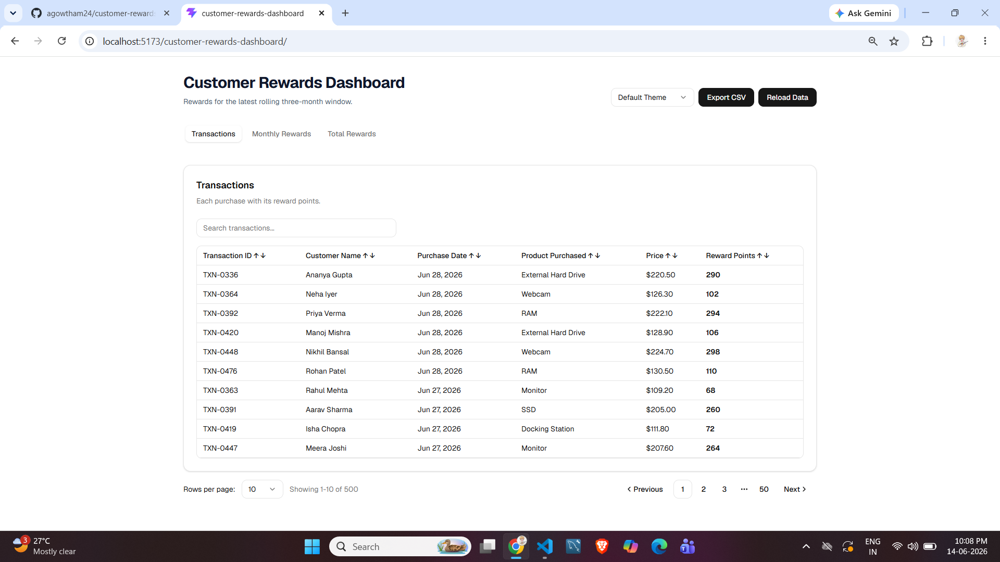
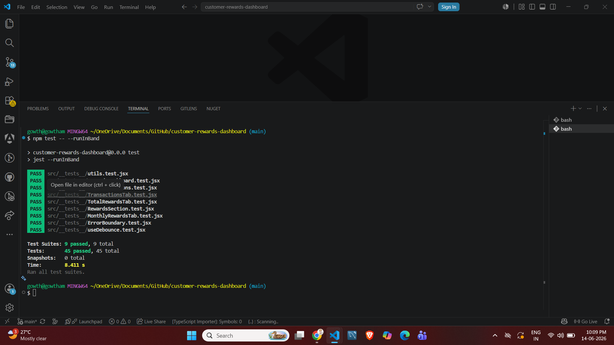

# Customer Rewards Dashboard

A React application that calculates and displays customer reward points based on transaction history within a rolling three-month period.

---

## Features

* Customer reward point calculation
* Monthly rewards aggregation
* Total rewards aggregation
* Transactions view
* Column sorting
* Search and filtering
* CSV export
* Pagination
* Loading, error, and empty states
* Reusable UI components
* Pure utility functions
* Unit test coverage
* Tailwind CSS + shadcn/ui

---

## Reward Rules

* 2 points for every dollar spent above `$100`
* 1 point for every dollar spent between `$50` and `$100`

### Example

Purchase amount: **$120**

Reward points:

* 50 points for spending between `$50-$100`
* 40 points for spending above `$100`

**Total: 90 points**

### Decimal Handling

* `100.2 → 50 points`
* `100.4 → 50 points`
* `120.9 → 90 points`

---

## Tech Stack

* React
* Vite
* Tailwind CSS
* shadcn/ui
* Jest
* React Testing Library

---

## Project Structure

```text
src/
│
├── components/
│   └── ui/
├── config/
├── hooks/
├── lib/
├── rewardsDashboard/
├── services/
├── __tests__/
```

---

## Installation

```bash
npm install
```

---

## Run Application

```bash
npm run dev
```

---

## Build

```bash
npm run build
```

---

## Run Tests

```bash
npm test
```

---

## Generate Coverage Report

```bash
npm test -- --coverage
```

---

## Screenshots

### Dashboard



### Test Execution



---

## Unit Tests

The project includes tests for:

* Reward point calculation
* Monthly rewards aggregation
* Total rewards aggregation
* Transaction enrichment
* Transaction sorting
* Loading state
* Error state
* Empty state
* Dashboard rendering
* Pagination behavior
* Custom hooks

---

## Architecture Highlights

* Reusable paginated tab component
* Reusable table components
* Memoized UI components
* Pure utility functions
* JSDoc documentation
* State-driven rendering
* Error boundary support
* Configurable themes
* Mock async API layer

---

## Deployment

GitHub Repository:

https://github.com/agowtham24/customer-rewards-dashboard

Application URL:

https://agowtham24.github.io/customer-rewards-dashboard/

---

## Test Summary

* 9 test suites
* 45 test cases
* All tests passing

---

## Notes

* No Redux used
* No TypeScript used
* Mock API implementation used
* Rewards are calculated over the latest rolling three-month period
* Components are designed to be reusable and maintainable
